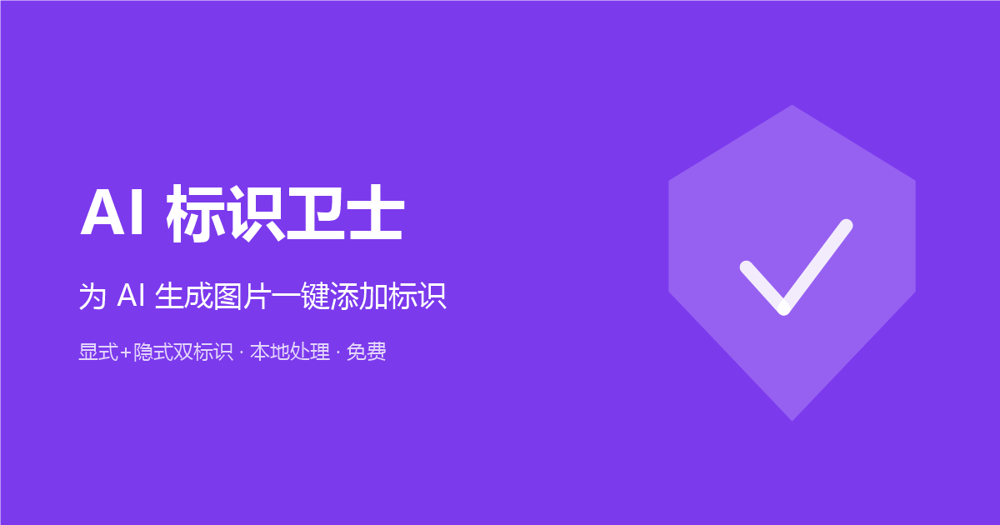

# ailabel

[English](README.md) | **简体中文**

> 中文版与英文版（事实源）保持同步，对应英文版 v1.0.0（2026-09-15）。

给 AI 生成图片一次打上两种标识：画面上的**显式角标** + 文件字节内的**标准 XMP 元数据**（IPTC `DigitalSourceType = trainedAlgorithmicMedia`）。100% 浏览器本地处理，零上传。

[](https://github.com/ikoobee/ailabel/actions/workflows/ci.yml)
[](LICENSE)
[](CHANGELOG.md)



## 为什么需要它

监管与平台日益要求 AI 生成内容同时携带人类可见标记与机器可读来源信息。ailabel 一次完成双轨标识：

- **标准化的隐式标识**——原生 PNG iTXt / JPEG APP1 字节级注入 `Iptc4xmpExt:DigitalSourceType` 与 `xmp:CreatorTool`，零依赖库，主流工具链（ExifTool、IPTC 校验器）可读。
- **输出元数据干净**——显式角标的重编码天然清空原 EXIF（含 GPS）；输出文件的元数据只有你选择写入的部分。
- **幂等注入**——已有 XMP 的文件跳过（`reason: 'exists'`），绝不重复写入；19 项回归测试保障。
- **实时预览 + 预设**——一键标识文案（「AI 生成」等或自定义），位置/字号/不透明度/描边实时预览，平铺模式防裁剪，批量 20 张。
- **零依赖、零构建**——原生 ES Module + Canvas，任意静态托管即部署；无账号、无上传、无埋点。

## 工作原理

```
解码 → applyWatermark（显式角标）→ toBlob
     → 字节级 XMP 注入（隐式标识）→ 输出
```

`js/engine.js` 渲染显式角标（默认值面向标识场景：右下角、4% 字号、90% 不透明、白字描边）；`js/metadata.js` 把 XMP 包注入输出字节——纯函数，Node 可测。

## 快速开始

```bash
git clone https://github.com/ikoobee/ailabel.git
cd ailabel
npx --yes serve .          # 任意静态文件服务器均可
# 打开 http://localhost:3000 —— 拖入图片（或点「试一张示例图」）、生成
```

运行元数据回归测试（Node 18+）：

```bash
npm test
```

## 程序化调用

```js
import { buildAiXmp, injectAiMetadata } from './js/metadata.js';

const xmp = buildAiXmp({ tool: 'my-app' });
const res = injectAiMetadata(pngOrJpegBytes, 'image/png', xmp);
// res.injected === true，或 reason: 'exists' | 'unsupported' | 'not-png'
```

## 自部署

把 `index.html`、`robots.txt`、`sitemap.xml`、`blog/zh/ai-image-label-guide.html` 中的 `your-domain.example` 替换为你的域名，整个目录丢到任意静态托管即可。统计埋点默认关闭（`js/analytics.js` 中 `provider: 'none'`）。

## 适用范围与边界（诚实明示）

- **不构成法律意见**。本工具是标识的技术辅助；是否满足特定法规（如中国 AI 生成内容标识办法、欧盟 AI 法案透明度义务）取决于你的具体场景。
- **WebP**：当前 WebP 输出跳过元数据标识（显式角标仍生效），页面有明确提示。
- **不做移除**。ailabel 只添加标识，刻意不提供任何移除能力。
- 不含 C2PA 内容凭证签名。

## 参与贡献

欢迎 issue 与 PR——见 [CONTRIBUTING.md](CONTRIBUTING.md)。贡献即视为按本项目 MIT 许可证同等授权（inbound = outbound）。

## 许可证

[MIT](LICENSE) © Ethan (ikoobee)
